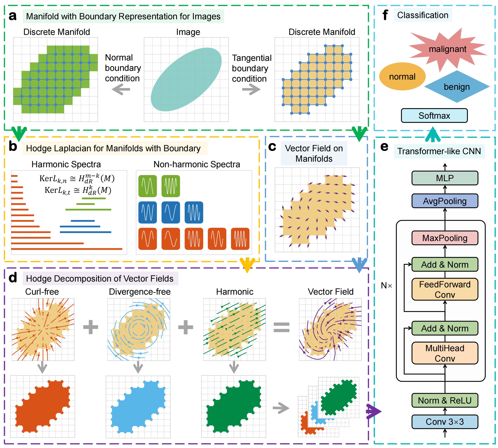

Topological Deep Learning on Differentable Manifolds
====

    This manual is for the code implementation of paper "Topological Deep Learning on Differentable Manifolds for Biomedical Data"
    
****


# TopoTransCNN model architecture
 


# How to Use
```linux
# prepare the decomposed image
python ./code/prepare_decomposition.py

# train model
python ./code/main.py
```
